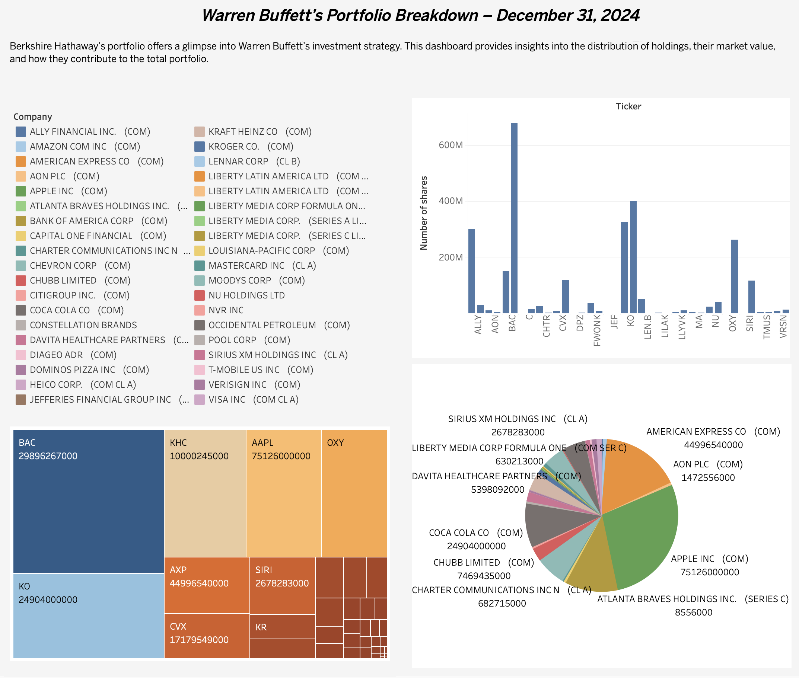

# Warren-Buffett-Portfolio-Analysis
This project analyzes Warren Buffett’s investment portfolio as of December 31, 2024. Using Tableau, we visualize key insights into Berkshire Hathaway’s holdings, including portfolio allocation, market value distribution, and top investments.

## Key Features
- Pie Chart – Shows the percentage allocation of each company in the portfolio.
- Heat Map – Highlights the largest investments by market value.
- Bar Chart – Ranks companies based on their total market value.
- Dashboard Design – Storytelling-driven layout for clear insights.

## Dataset
The dataset includes the following fields:

- Company: Name of the company in Buffett’s portfolio
- Ticker: Stock ticker symbol
- Market Value (Dec 31, 2024): Total market value of the holding
- Number of Shares: Total shares owned
- % of Total Portfolio: Weight of each investment in the portfolio

## Screenshots

## How to Use
- Load the dataset into Tableau.
- Use the provided visualizations to explore the data.
- Customize or add new insights based on your analysis.
